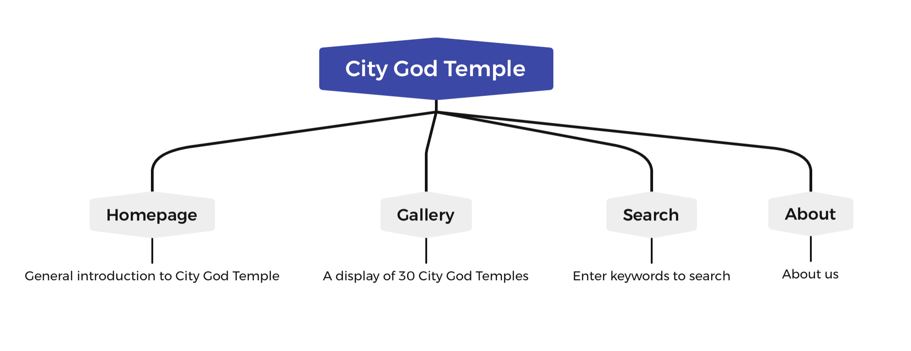

# City-God-Temple
## Background
We are doing this project to give people a better understanding of the culture of the Chinese city gods. By showcasing representative City God temples across China, we are able to promote the historical background and heritage of Chinese Taoist culture.
## Site Content & Structure 

## Task Plan
### Timeline
1. Week 1: Everyone will collect information (text and images) from the website and puts it together.
2. Week 2-3: Chen Yingxuan will be responsible for the overall architecture and design of the website.
           Wu Xinxuan will write CSS files.
           Peng Chenchen will write md files.
3. Week4: We will work together to improve the site until the task is complete.
### Communication
Team meetings will be held via Teams at each project point, mainly via WeChat, to ensure timely and effective communication.
### Special Cases
If a member has difficulty in completing a task, we will give each other help or switch the task. However, we will ensure that we try to complete our work before each deadline.

## Contributors: @Inciel @pengchenchen @Wuxinxuan

